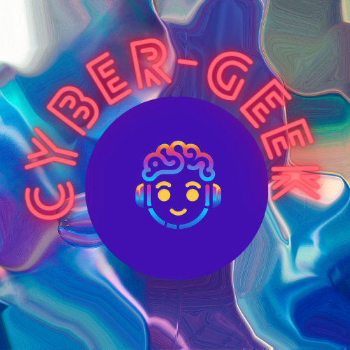

  

-------------------------------------------

Hi i'm Joe00271 i'm interrested in **Cybersecurity** , my first account has been suspend i don't know why but i'm currently working in:
- Cybersecurity GUI
- AES encrypt GUI

  

  

  
  
  
  
  

  

<!---
joe00271/joe00271 is a ✨ special ✨ repository because its `README.md` (this file) appears on your GitHub profile.
You can click the Preview link to take a look at your changes.
--->
